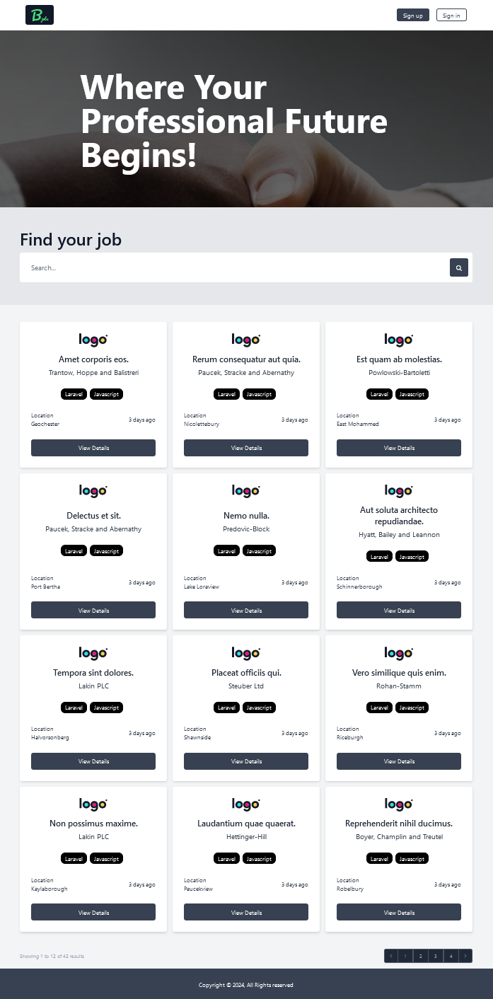

## Jobs Listing Laravel



### Description:

I have developed a comprehensive web platform for posting and managing job listings, utilizing a wide range of technologies including HTML, Tailwind CSS, Alpine JS, and Laravel. The platform is designed to be user-friendly for both employers and applicants, offering an intuitive interface.

### Technologies Used:

Frontend: HTML, Tailwind CSS, Alpine JS for interactivity and responsive design.
Backend: Laravel for data management, authentication, and authorization.
Databases: MySQL for storing user and job listing information.

### Key Features:

**Authentication and Authorization**: Implementation of a secure authentication system for users, with authorization management using gates.
**Job Posting and Management**: Employers can post, edit, and delete their job listings. Users can browse and apply to available job listings.
**Profile and Password Management**: Each user has the ability to edit their profile and change their password.
**Administrator Role**: Implementation of an admin dashboard for administrators, providing an overview of registered users, the number of employers and applicants, as well as the total number of job listings. The administrator can block or delete users as needed.
**Results**: The platform has been successfully developed, providing a complete and efficient solution for posting and managing job listings. The proper implementation of key functionalities and security measures has led to a smooth and secure experience for all users.

## Tech stack

-   Tailwind CSS
-   Custom [Admin template](https://www.tailwindawesome.com/resources/tailwind-admin-template) in backend
-   Alpine JS
-   Laravel

## How to run the project

### Clone or download project

Run the following

```
npm install
composer update --no-scripts
```

### Database Setup

This app uses MySQL. If you want to use something different, open up config/Database.php and change the default driver.

To use MySQL, setup a database and then add your db credentials(database, username and password) to the .env.example file and rename it to .env and run following

```
php artisan key:generate
```

### Migrations

To create all tables and columns, run the following

```
php artisan migrate
```

### Seeding The Database

You can add dummy data in the database with database seeder and factory.

### File Uploading

This app doesn`t use storage folder for uploading files so you do not need to create a symlink

### Running The App

Upload the files to your document root or run

```
php artisan serve
npm run dev
```

## License

This app is open-sourced software licensed under the [MIT license](https://opensource.org/licenses/MIT).
